<p align="center">
  
</p>

# 🏏 CricketVerse AI
> **An Intelligent Mobile Application for Live Cricket Scoring, AI Commentary, Match Prediction, and Real-Time Analytics.**

CricketVerse AI is a full-stack cricket management and live-scoring system. The Flutter application provides role-based dashboards for administrators, scorers, and fans, while the TypeScript backend handles authentication, match operations, persistence, real-time updates, AI voice commentary, and win-probability predictions.

---

## 📸 App Screenshots

Here are the application walkthrough screens:

### 🛡️ Admin Screens

### Admin Panels & Dashboard

| Admin Login | Admin Dashboard | Tournament List |
| :---: | :---: | :---: |
| 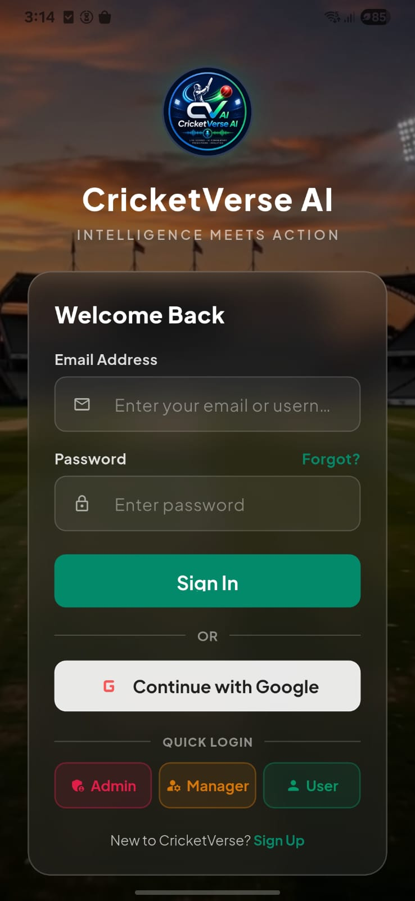 | 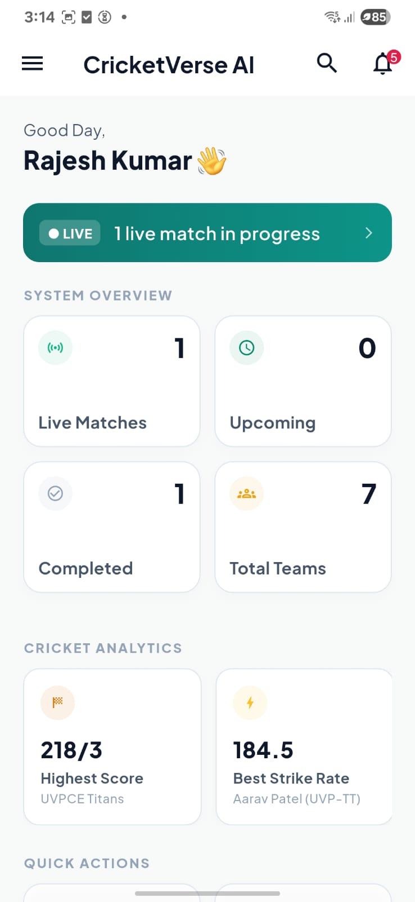 | 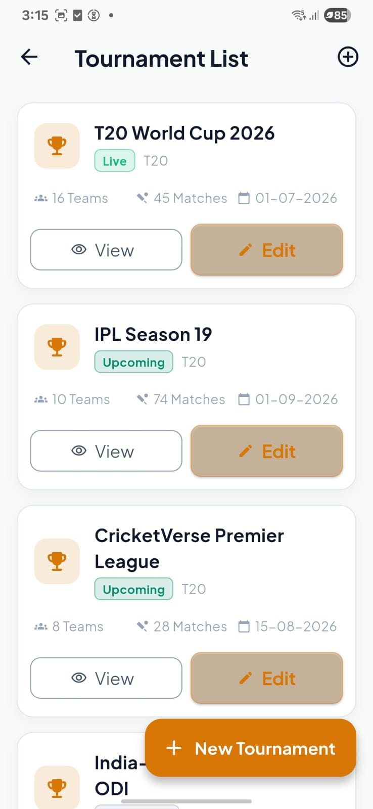 |
| *Admin / Multi-Role Authentication* | *System Overview & Analytics Home* | *Active Tournaments Feed* |

| Team Management | Player Management | Player Details |
| :---: | :---: | :---: |
| 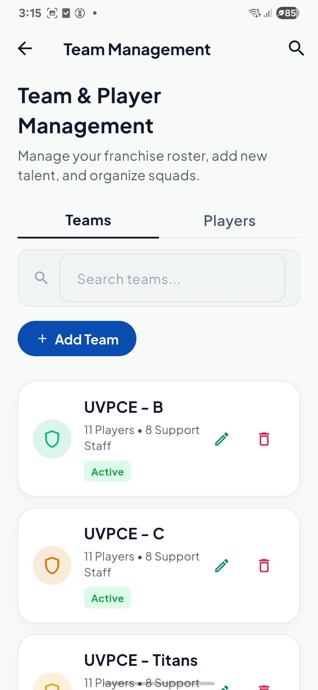 | 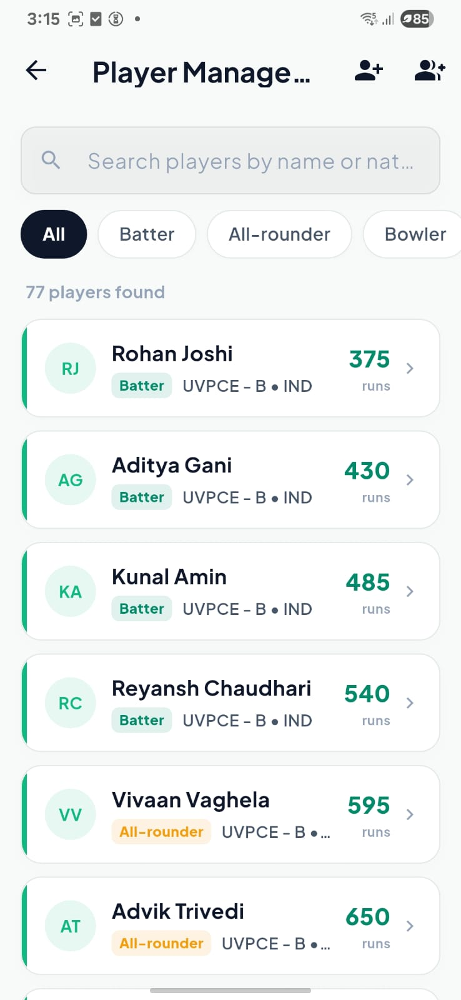 | 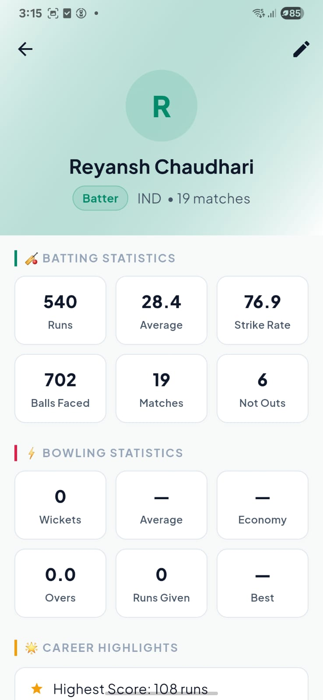 |
| *Franchise Roster & Squad Control* | *Player Directory & Category Filters* | *Individual Player Career Statistics* |

| AI Settings | Notifications | General Statistics |
| :---: | :---: | :---: |
| 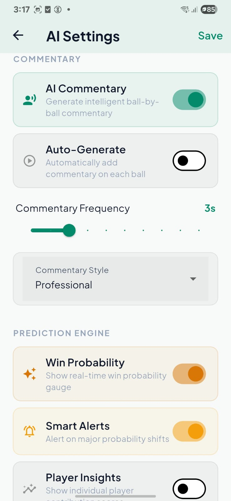 | 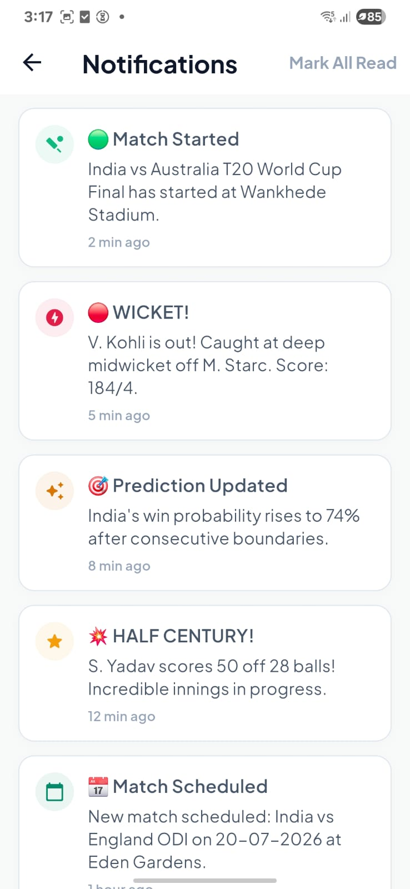 | 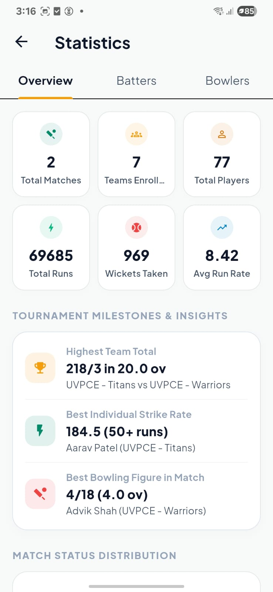 |
| *Voice Commentary & Win Predictor Config* | *Real-Time Live Match Notifications* | *Tournament Overviews & Milestones* |

### 📝 Manager Screens

### Live Scoring & Control Panels

| Live Scoring Terminal | Record Wicket Dialog |
| :---: | :---: |
| 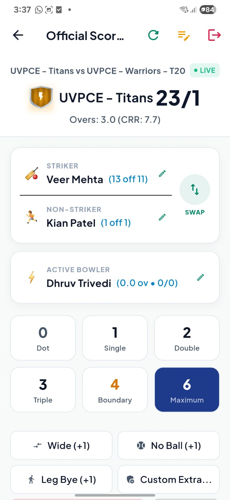 | 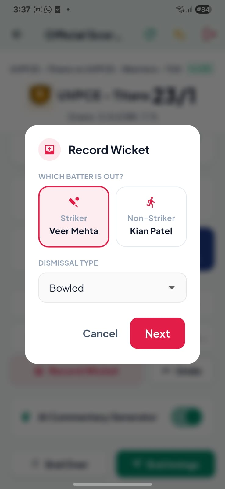 |
| *Live scoring terminal for official managers* | *Wicket recording overlay dialog* |

### 👤 User / Fan Screens

### Live Match View & Analytics

| Fan Dashboard | Fan Live Match Details | Match Summary Report |
| :---: | :---: | :---: |
| 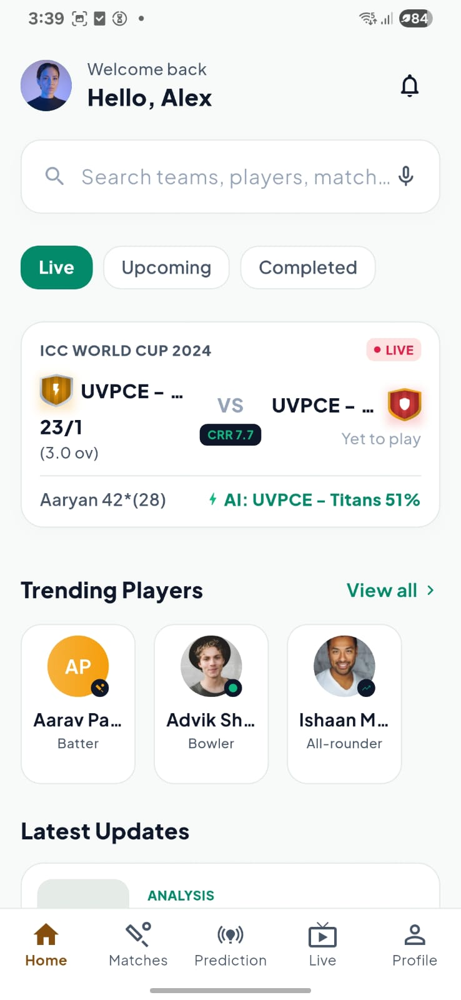 | 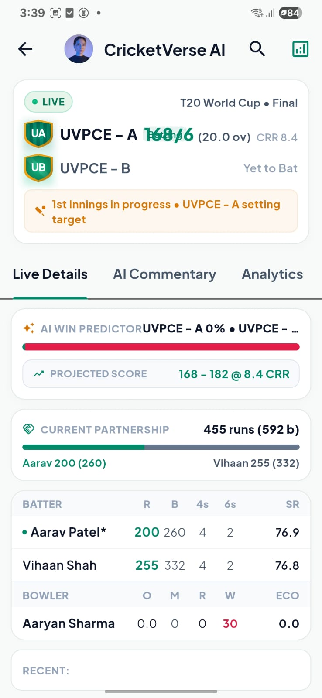 | 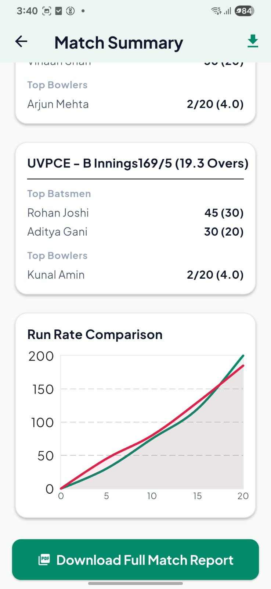 |
| *Fan live match scoring hub* | *Live scoreboard & player stats* | *Innings summary & download report* |

| Match Predictions | Scenario Simulator | AI Commentary |
| :---: | :---: | :---: |
| 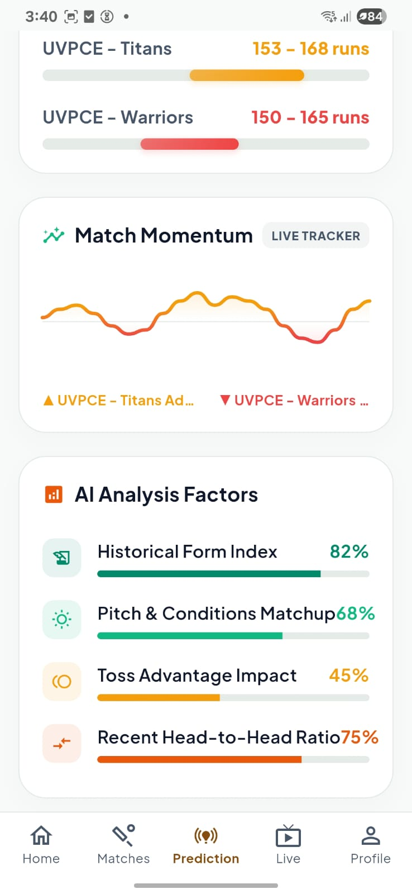 | 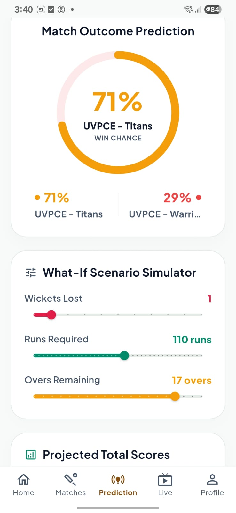 | 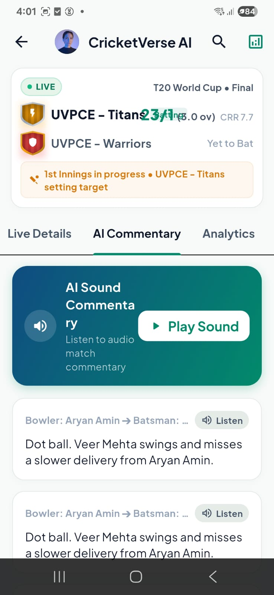 |
| *AI analytics & momentum tracker* | *What-If prediction scenario sliders* | *Live AI generated audio commentary* |

---

## 🚀 Key Features

- **Live Match Center**: Real-time scoring, ball-by-ball updates, and dynamic scoreboards.
- **AI-Powered Insights**: Event-based cricket commentary, ElevenLabs voice synthesis, and live win-probability predictions with interpretable match factors.
- **Tournament Management**: Complete administration of tournaments, matches, teams, and players.
- **Comprehensive Statistics**: High-fidelity charts and graphs for player/team performance tracking.
- **Role-Based Access**: Dedicated dashboards and workflows for Admins, Managers, and End-Users.
- **Premium UI/UX**: Dark mode by default, Hero animations, smooth page transitions, shimmer loading effects, and modern typography.

---

## 🛠 Technology Stack

### Mobile Application

- **Framework**: Flutter 3.x
- **Language**: Dart
- **State and local storage**: Provider, Hive, and SharedPreferences
- **Networking and real-time data**: HTTP REST client and Socket.IO client
- **Voice playback**: audioplayers with Flutter TTS fallback
- **Reports and charts**: PDF/printing packages and fl_chart
- **UI**: Material 3, custom theme, Google Fonts, shimmer loading, and animations

### Backend

- **Runtime and language**: Node.js and TypeScript
- **API**: Express.js REST API
- **Database**: MongoDB with Mongoose
- **Real-time communication**: Socket.IO, with optional Redis adapter support
- **Security**: JWT authentication, bcrypt password hashing, and role-based middleware
- **Voice generation**: ElevenLabs Text-to-Speech API using the `eleven_turbo_v2_5` model, configurable voices, and cached audio responses

### Machine Learning

- **Language and libraries**: Python, pandas, NumPy, scikit-learn, and joblib
- **Model**: StandardScaler + LogisticRegression pipeline
- **Prediction**: Team win probability, not exact final-score prediction
- **Features**: Team strength, toss state, scores, wickets, overs, current run rate, balls remaining, target, runs needed, and required run rate
- **Current evaluation**: 77.83% test accuracy and 78.18% training accuracy on the repository's simulated match-state dataset using an 80/20 split with `random_state=42`
- **Data limitation**: The dataset is generated by `backend/ml_model/generate_mock_data.py`; the accuracy is therefore a prototype metric and should not be presented as validation on historical professional matches.

---

## 👥 User Roles & Page Architecture

The application is structured around **3 distinct user roles**, totaling over **30 meticulously designed screens**.

### 1. 🛡️ Admin (19 Dedicated Pages)
*Credentials: `admin@cricketverse.ai` / `admin123`*
The Admin has full control over the ecosystem.
*   **Dashboards**: Admin Home Dashboard
*   **Match Management**: Match List, Match Details, Schedule Match
*   **Team & Player Management**: Team List, Team Details, Player List, Player Details
*   **Tournament Management**: Tournament List, Create Tournament
*   **Live Operations**: Live Scoring Terminal (Admin Override)
*   **AI & Analytics**: AI Commentary Feed, Prediction Engine, Analytics & Statistics
*   **System**: Notifications, Admin Profile, AI Settings, Help & Support, About Project

### 2. 📝 Match Manager (Official/Moderator) (2 Dedicated Pages)
*Credentials: `manager@cricketverse.ai` / `manager123`*
The Match Manager is responsible for updating live match events.
*   **Dashboards**: Manager Dashboard (Active Matches)
*   **Live Operations**: Live Ball-by-Ball Entry Screen

### 3. 👤 User (Cricket Fan) (2 Dedicated Pages)
*Credentials: `user@gmail.com` / `user123`*
The User consumes the live data, statistics, and predictions.
*   **Dashboards**: Fan Dashboard (Live Scores, News, Standing)
*   **Export**: Match Summary Download / Export Screen

### 🌐 Shared & Core Pages (7 Pages)
Common screens accessible during the user journey.
*   **App Entry**: Splash Screen, Interactive Onboarding, Authentication (Login/Signup)
*   **Shared Details**: Public Match Details, Public Team Details, Public Player Details, News Details

---

## 🎨 Design Philosophy

CricketVerse AI prioritizes **Visual Excellence**. 
- **Zero Dead Buttons**: Every clickable element leads to a meaningful interaction or screen.
- **Harmonious Palette**: Deep space backgrounds (`#0F172A`) contrasted with vibrant accents (Emerald Green, Sky Blue, Amber).
- **Micro-interactions**: Pulse animations on live scores, haptic feedback on scoring events.
- **Graceful Loading**: Shimmer effects replace traditional loading spinners for a premium feel.

---

## 🏃‍♂️ How to Run Locally

### Mobile application

1. Ensure you have the [Flutter SDK](https://docs.flutter.dev/get-started/install) installed.
2. Navigate to the mobile application:
   ```bash
   cd mobile_app
   flutter pub get
   flutter run
   ```

### Backend

1. Ensure Node.js, MongoDB, and Python are installed.
2. Configure `backend/.env` with `MONGODB_URI`, `JWT_SECRET`, and optionally `ELEVENLABS_API_KEY`.
3. Install dependencies and start the API:
   ```bash
   cd backend
   npm install
   npm run dev
   ```

The backend runs on port `3000` by default. Use `npm run seed` to create seed data and `npm test` to run the integration test script.

### ML predictor

From the repository root:

```bash
python backend/ml_model/train_model.py
```

The script trains the model, prints the classification metrics, and writes the serialized pipeline to `backend/ml_model/cricket_win_predictor.joblib`. Generate a fresh simulated dataset first with:

```bash
python backend/ml_model/generate_mock_data.py
```

---
*Built as a B.Tech Major Project prototype.*
